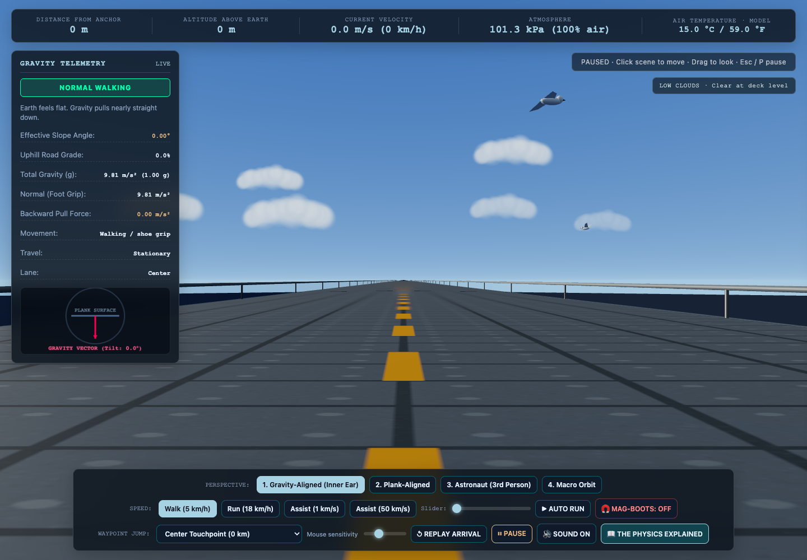

# Earth Plank

Walk from Earth's surface toward space on a **50,000 km long plank** tangent to the planet. Watch Earth curve away beneath you, pass through clouds, and feel gravity pull you back toward the center as the effective slope increases.



## Install and play

You'll need **Python 3** and a desktop browser with WebGL support. Chrome is tested. All game libraries and textures are included; there is no build step or dependency install.

```bash
git clone https://github.com/timtoole02/Earth-Plank.git
cd Earth-Plank
python3 -m http.server 8080 --bind 127.0.0.1
```

Open **[http://localhost:8080](http://localhost:8080)** in your browser. On Windows, use `py -3 -m http.server 8080 --bind 127.0.0.1` instead. You can also download and extract the repository ZIP, then run the server from the extracted folder.

If you have Node.js/npm installed, `npm start` starts the Python server too. Stop the server with **Ctrl+C** in its terminal. If port 8080 is busy, replace it with 8081 in both the command and browser address.

Use the local server rather than opening `index.html` directly: the game's JavaScript modules need HTTP.

## Your first trip

1. Watch the 29-second arrival from space, or choose **Skip**. Look for the Moon, Sun, stars, two satellites, a quick UFO flyby, and an airplane during the descent.
2. **Click the scene** to enable movement. Hold the left mouse button and drag to look around.
3. Use **W/S** to walk along the plank and **A/D** to move sideways. Looking around doesn't change your travel direction.
4. Try **Inside the Clouds (140.5 km)** in the waypoint menu to walk through mist. Birds circle near the deck at lower altitudes, and visibility clears above the cloud layer.
5. Try farther waypoints to see the curved Earth, changing gravity, thinning atmosphere, and loss of shoe traction. Switch camera views to compare how the same straight plank appears.

## Controls

| Input | Action |
| --- | --- |
| Click the scene | Enable movement or resume after pausing |
| Hold left mouse button + drag | Look around; the cursor stays free |
| W / S or Up / Down | Move along the plank in either direction |
| A / D or Left / Right | Move sideways across the deck |
| Shift | Sprint at 2.5× the selected target speed |
| Space / Auto Run button | Toggle automatic travel in the last W/S direction |
| **Escape / P / Pause button** | **Stop movement and auto-run; click the scene to resume** |
| 1 | Gravity-aligned first-person view |
| 2 | Plank-aligned first-person view |
| 3 | Astronaut third-person view |
| 4 | Macro orbit view; drag to rotate and scroll to zoom |
| Walk / Run | Select a target pace of about 5 / 18 km/h |
| Assist buttons / speed slider | Choose faster travel, including powered 1 km/s and 50 km/s presets |
| Mag-Boots | Toggle extra adhesion and grip; off by default |
| Waypoint Jump | Teleport to a milestone while keeping your lane |
| Mouse sensitivity slider | Adjust look speed |
| Replay Arrival | Restart the space-to-deck flight at the center anchor |
| Sound | Toggle procedural footsteps, wind, and thruster audio |
| The Physics Explained | Open the in-game explanation and control guide |

During the arrival, **Escape**, **P**, or **Skip** goes straight to the deck. The game never captures the mouse pointer. If keyboard movement isn't responding after using a menu, click the scene again. **P** and the visible **Pause** button are alternatives if the browser intercepts Escape.

## What's simulated

The HUD shows distance from the anchor, altitude, velocity, atmospheric pressure, modeled air temperature in °C/°F, gravity, effective slope, traction, and travel direction.

- The rigid plank is 30 m wide and 50,000 km long, touching a spherical Earth at its center. Earth's radius is 6,371 km.
- Gravity points toward Earth's center and weakens with the inverse square of distance. Traveling outward increases altitude and the component of gravity pulling you back along the plank.
- Walking and running integrate gravity, limited shoe traction, sliding friction, braking, and atmospheric drag. Actual speed depends on these forces. Mag-boots add adhesion; high-speed assisted travel compensates gravity and drag.
- Air temperature, pressure, and density use a layered standard-atmosphere model through 84.852 km geopotential altitude. Above that, pressure/density use an approximate tail and temperature is marked outside the model or unavailable in space.
- Clouds, birds, and cinematic flybys are animated scenery. This is a simplified gameplay model, with no live weather, oxygen or suit-temperature simulation, planetary rotation, or structural bending of the plank.

A straight plank stays geometrically straight: changing between gravity-aligned and plank-aligned cameras changes its apparent orientation relative to you.

## Development

The game uses plain JavaScript modules and locally bundled Three.js r160. Edit the files and refresh the browser; no bundler is required.

```bash
# Optional: requires Node.js 20 or newer
npm test
```

The test suite covers gravity, atmosphere, motion and traction, arrival-path continuity, and cloud/bird visibility rules.

```text
index.html / styles.css   Interface and styling
js/main.js               Scene, lighting, animation loop, and transitions
js/earth.js              Earth textures, atmosphere, and stable surface depth
js/plank.js              Deck geometry and milestone markers
js/player.js             Controls, camera modes, and astronaut
js/physics.js            Gravity and atmosphere model
js/motion.js             Walking, drag, friction, and assisted travel
js/intro.js              Arrival scene and flybys
js/arrival-path.js        Smooth cinematic camera path
js/weather.js            Clouds and animated birds
js/weather-model.js      Cloud density and visibility rules
js/hud.js / audio.js      Telemetry and procedural sound
assets/ / vendor/        Bundled textures and Three.js
tests/                  Automated regression tests
```

## License and credits

Earth Plank is available under the [MIT License](LICENSE). Bundled Three.js and OrbitControls retain their [MIT license](vendor/LICENSE.three.js). Earth texture assets are bundled in `assets/`; see [third-party notices](THIRD_PARTY_NOTICES.md).
